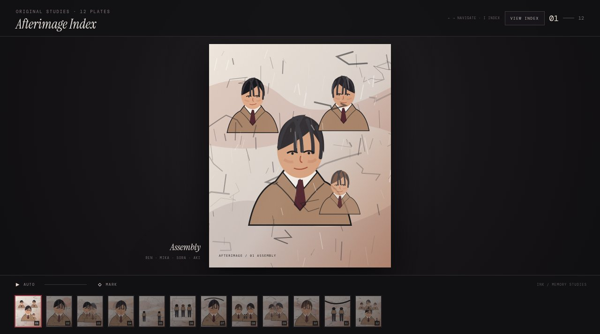

# Afterimage Index

Twelve original ink-washed character studies in an interactive filmstrip.



**Live:** https://aeiouvcode.github.io/afterimage-index/

## About

A small gallery of original figure studies (Ren, Mika, Sora, Aki and others) presented as numbered plates. Step through them one at a time, open the full index, or let the sequence run on its own. Marks you leave on plates stay on your device.

## Controls

- Left / right arrows: previous / next plate
- `I`: index view
- Auto: play the sequence

## Built with

A single self-contained `index.html` with the plates embedded. No network requests.

## Run locally

```sh
git clone https://github.com/aeiouvcode/afterimage-index.git
cd afterimage-index
python3 -m http.server 8000
```

Then open http://localhost:8000.
